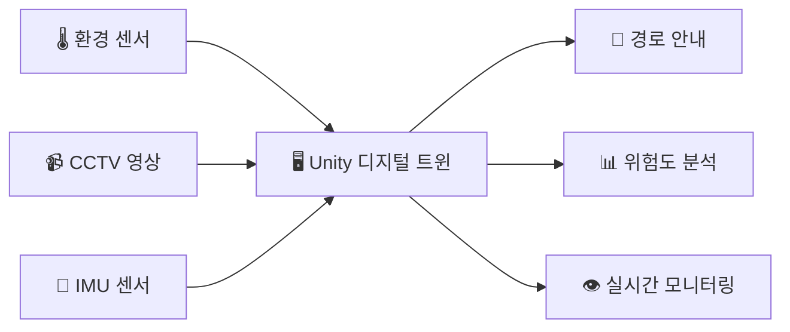

# 🔥 SSAFY 건물 Unity 기반 화재 대응 지휘·관제 시스템

<div align="center">


</div>

---

## 🎯 프로젝트 개요

> **화재 현장의 디지털 트윈 - 생명을 구하는 기술**

```
🏢 실제 건물        📹 CCTV + 센서        🎮 Unity 디지털 트윈        👨‍🚒 소방관
     │                    │                      │                     │
  화재 발생      →    실시간 모니터링     →    3D 시각화 & 분석    →   최적 경로 안내
```

**목적:** 화재 현장에서 소방관의 구조 및 진압 활동을 지원하는 디지털 트윈 기반 지휘·관제 시스템 구축

### 💡 핵심 아이디어



- **실시간 센싱**: 건물 내 사람과 환경 정보를 다중 센서로 수집
- **디지털 트윈**: Unity 환경에 현실을 실시간 반영
- **지능형 지원**: 생존 가능성 분석 및 최적 경로 안내 제공

---

## 🚒 시나리오 플로우

<div align="center">

```
🔥 화재 발생
    ↓
👨‍🚒 소방관 출동 & 현장 도착
    ↓
📊 실시간 데이터 수집
├── 🌡️ 온도, CO₂, 습도 센싱
├── 📹 CCTV 객체 인식 (사람 위치·자세)
└── 📱 소방관 IMU 데이터
    ↓
🎮 Unity 디지털 트윈 구성
├── 🧑‍🤝‍🧑 구조 대상자 Agent 생성
├── 👨‍🚒 소방관 Agent 동기화  
└── 🗺️ 실시간 위험도 맵핑
    ↓
🧭 지휘·관제 지원
├── 📍 최적 구조 경로 계산
├── ⚠️ 위험 구역 회피 안내
└── 📊 생존 확률 모니터링
    ↓
✅ 안전한 구조 & 대피 완료
```

</div>

---

## 🛠️ MVP 기능 Overview

<table>
<tr>
<td width="50%">

### 🎮 Unity 3D 시각화
- 🏢 **건물 맵 렌더링**
- 🧑‍🤝‍🧑 **Agent 실시간 생성**
- 🎭 **상태별 애니메이션**
  - 🚶‍♂️ 걷기
  - 🏃‍♂️ 뛰기  
  - 😵 쓰러짐

</td>
<td width="50%">

### 📊 지휘·관제 시스템
- 📈 **실시간 대시보드**
- 🗺️ **위험도 히트맵**
- 🧭 **네비게이션 시스템**
- 📱 **소방관 디바이스 연동**

</td>
</tr>
</table>

---

## 📋 MVP 구현 로드맵

### Phase -1: 🗺️ 맵 렌더링
```cpp
// Unity 3D 건물 맵 구현
class BuildingMap {
    void LoadFloorPlan();
    void SetupNavMesh();
    void InitializeCoordinateSystem();
};
```

### Phase 0: 🤖 AI 객체 탐지
```python
# CCTV 사람 탐지 모델
class PersonDetector:
    def detect_persons(self, frame):
        # YOLO/R-CNN 기반 탐지
        return person_coordinates
    
    def send_to_unity(self, coords):
        # C# Unity로 좌표 데이터 전송
        mqtt_client.publish("person/coords", coords)
```

### Phase 1: 👤 Agent 렌더링
```csharp
// Unity Agent 생성 및 좌표 정합
public class AgentManager : MonoBehaviour {
    public void CreateAgentAtPosition(Vector3 realWorldPos) {
        Vector3 unityPos = CoordinateMapper.RealToUnity(realWorldPos);
        GameObject agent = Instantiate(agentPrefab, unityPos);
    }
}
```

### Phase 2: 🎭 Agent Animation
```csharp
// 상태별 애니메이션 제어
public enum PersonState { Walking, Running, Collapsed }

public class PersonAnimator : MonoBehaviour {
    public void SetState(PersonState state) {
        animator.SetTrigger(state.ToString());
    }
}
```

### Phase 3: 📱 IMU + PDR 알고리즘
```cpp
// C++ PDR 구현 (임베디드 친화적)
class PDRTracker {
private:
    Eigen::Vector3d position;
    Eigen::Vector3d velocity;
    double heading;
    
public:
    void updateIMU(const IMUData& data);
    void correctDrift(const Vector3d& knownPosition);
    Vector3d getCurrentPosition() const;
};

// Kalman Filter for drift correction
class KalmanPDR {
    Eigen::MatrixXd F, H, Q, R;  // State transition, observation, noise
    Eigen::VectorXd x;           // State vector [x, y, vx, vy, heading]
    Eigen::MatrixXd P;           // Covariance matrix
};
```

### Phase 4: 🌡️ 환경 센싱 + 위험도 계산
```cpp
// 환경 데이터 처리 및 생존 확률 계산
struct EnvironmentData {
    float temperature;
    float co2_level;
    float humidity;
    float smoke_density;
};

class SurvivalCalculator {
public:
    float calculateSurvivalTime(const EnvironmentData& env) {
        // WHO 기준 기반 생존 시간 모델링
        float temp_factor = exp(-0.1 * (env.temperature - 60));
        float co2_factor = exp(-0.05 * env.co2_level);
        return base_survival_time * temp_factor * co2_factor;
    }
    
    float calculateRiskLevel(const EnvironmentData& env) {
        return 1.0f - (calculateSurvivalTime(env) / max_survival_time);
    }
};
```

### Phase 5: 🧭 경로 계획 & 네비게이션
```cpp
// A* 알고리즘 + 동적 코스트 맵
class FireScenePathfinder {
private:
    struct Node {
        int x, y;
        float g_cost, h_cost, f_cost;
        float environment_cost;  // 온도, 연기 등 환경 위험도
        Node* parent;
    };
    
    std::vector<std::vector<float>> risk_map;
    
public:
    std::vector<Vector2> findOptimalPath(Vector2 start, Vector2 goal) {
        // A* + 환경 위험도 가중치
        // f(n) = g(n) + h(n) + environment_cost(n)
    }
    
    void updateRiskMap(const std::vector<EnvironmentData>& sensor_data) {
        for (auto& data : sensor_data) {
            risk_map[data.x][data.y] = calculateRisk(data);
        }
    }
};
```

### Phase 6: 📊 지휘/관제 대시보드
```csharp
// Unity UI 대시보드
public class CommandDashboard : MonoBehaviour {
    [Header("Real-time Monitoring")]
    public Text survivorCount;
    public Text firefighterStatus;
    public Slider[] riskLevels;
    
    [Header("Path Visualization")]
    public LineRenderer optimalPath;
    public Transform[] waypoints;
    
    void Update() {
        UpdateSurvivorInfo();
        UpdateRiskHeatmap();
        UpdateFirefighterPositions();
    }
}
```

### 🔄 통신 아키텍처 (ROS2/MQTT)
```cpp
// ROS2 노드 구조
class FireResponseNode : public rclcpp::Node {
private:
    // Publishers
    rclcpp::Publisher<geometry_msgs::msg::Point>::SharedPtr person_pos_pub;
    rclcpp::Publisher<sensor_msgs::msg::Imu>::SharedPtr imu_pub;
    
    // Subscribers  
    rclcpp::Subscription<custom_msgs::msg::EnvironmentData>::SharedPtr env_sub;
    
    // Services
    rclcpp::Service<custom_msgs::srv::PathPlan>::SharedPtr path_service;
    
public:
    void publishPersonPosition(float x, float y, float z);
    void handleEnvironmentData(const custom_msgs::msg::EnvironmentData& msg);
};
```

---

## 🏗️ 시스템 아키텍처

<div align="center">

```
┌─────────────────┐    ┌─────────────────┐    ┌─────────────────┐
│   🏢 현실 공간   │    │   🖥️ 서버 시스템   │    │  🎮 Unity 클라이언트 │
├─────────────────┤    ├─────────────────┤    ├─────────────────┤
│ 📹 CCTV 시스템   │───▶│ 🤖 객체 탐지 AI  │───▶│ 👤 Agent 렌더링  │
│ 🌡️ 환경 센서     │───▶│ 📊 데이터 분석   │───▶│ 🗺️ 3D 맵 시각화  │
│ 📱 IMU 센서      │───▶│ 🧭 경로 계획     │───▶│ 📈 실시간 대시보드 │
│ 👨‍🚒 소방관       │◀───│ 🔄 ROS2/MQTT    │◀───│ 🎯 지휘·관제 UI  │
└─────────────────┘    └─────────────────┘    └─────────────────┘
```

</div>

---

## ⚠️ 기술적 Risk & Mitigation

<table>
<tr><th>🚨 Risk Category</th><th>📋 Issues</th><th>💡 Mitigation Strategy</th></tr>
<tr>
<td><strong>🎯 정확도</strong></td>
<td>
• IMU 드리프트 누적<br>
• 객체 인식 오류<br>
• 좌표 정합 불일치
</td>
<td>
• Kalman Filter 센서 융합<br>
• Multi-frame 검증<br>
• 캘리브레이션 자동화
</td>
</tr>
<tr>
<td><strong>⚡ 실시간성</strong></td>
<td>
• 네트워크 지연<br>
• 처리 성능 부족<br>
• 경로 계산 지연
</td>
<td>
• Edge Computing<br>
• GPU 가속 처리<br>
• 예측 알고리즘 적용
</td>
</tr>
<tr>
<td><strong>🔥 환경 내성</strong></td>
<td>
• 고온으로 인한 센서 오작동<br>
• 연기로 인한 시야 차단<br>
• 통신 두절
</td>
<td>
• 내열 센서 사용<br>
• 적외선 카메라 병행<br>
• Mesh Network 구성
</td>
</tr>
</table>

---

## 🚀 기술 스택 & 도구

<div align="center">

### 🎮 Frontend & Visualization


### 🔧 Backend & Processing  


### 🤖 AI & ML


### 📡 Communication


### 🔨 Development Tools


</div>

---

## 🚀 Quick Start

### 📋 Prerequisites
```bash
# System Requirements
Unity 2022.3 LTS+
ROS2 Humble Hawksbill
Python 3.8+
C++17 Compiler (GCC 9+ / Clang 10+)
CUDA 11.0+ (for AI inference)
```

### 🏃‍♂️ Running the System
```bash
# Terminal 1: ROS2 Core Nodes
ros2 launch fire_response_core system.launch.py

# Terminal 2: AI Detection Service
python scripts/person_detector.py --model weights/yolo_fire.pt

# Terminal 3: Unity (or run from Unity Editor)
./build/FireResponseSystem
```

---

## 👥 팀 구성 & 역할

<table>
<tr>
<th>🎯 Role</th>
<th>👤 Member</th>
<th>📋 Responsibilities</th>
<th>🛠️ Tech Stack</th>
</tr>
<tr>
<td><strong>🎮 Unity 개발</strong></td>
<td>개발자 A</td>
<td>
• 3D 맵 렌더링<br>
• Agent 시스템<br>
• UI/UX 대시보드
</td>
<td>Unity, C#, Shader</td>
</tr>
<tr>
<td><strong>🤖 AI/ML</strong></td>
<td>개발자 B</td>
<td>
• 객체 탐지 모델<br>
• 경로 계획 알고리즘<br>
• 데이터 전처리
</td>
<td>Python, PyTorch, OpenCV</td>
</tr>
<tr>
<td><strong>🔧 임베디드</strong></td>
<td>개발자 C</td>
<td>
• IMU 센서 처리<br>
• PDR 알고리즘<br>
• 실시간 통신
</td>
<td>C++, ROS2, 센서 융합</td>
</tr>
<tr>
<td><strong>🌐 백엔드</strong></td>
<td>개발자 D</td>
<td>
• 서버 아키텍처<br>
• 데이터베이스<br>
• API 설계
</td>
<td>Node.js, MQTT, Docker</td>
</tr>
</table>

---

## 📊 프로젝트 현황

```
Progress: ████████████░░░░ 75%
```

- ✅ **환경 설정 완료**
- ✅ **기본 아키텍처 설계**  
- 🔄 **Unity 맵 렌더링 (진행중)**
- 🔄 **AI 모델 학습 (진행중)**
- ⏳ **IMU 센서 연동 (대기중)**
- ⏳ **통합 테스트 (대기중)**

---

## 📸 스크린샷 & 데모

<div align="center">

### 🎮 Unity 3D 맵 & Agent 시스템
`[스크린샷 영역 - Unity 3D 건물 맵과 실시간 Agent들]`

### 📊 실시간 대시보드
`[스크린샷 영역 - 지휘관제 대시보드 UI]`

### 🧭 경로 계획 시각화  
`[스크린샷 영역 - 최적 경로 및 위험도 맵]`

</div>

---

## 🤝 Contributing

1. 🍴 **Fork** the Project
2. 🌿 **Create** your Feature Branch (`git checkout -b feature/AmazingFeature`)
3. 💾 **Commit** your Changes (`git commit -m 'Add some AmazingFeature'`)
4. 📤 **Push** to the Branch (`git push origin feature/AmazingFeature`)
5. 🔄 **Open** a Pull Request

---


## 📄 License

This project is licensed under the **MIT License** - see the [LICENSE](LICENSE) file for details.

<div align="center">

**🔥 화재 현장의 디지털 혁신, 생명을 구하는 기술 🔥**

*Made with ❤️ by SSAFY Fire Response Team*

</div>