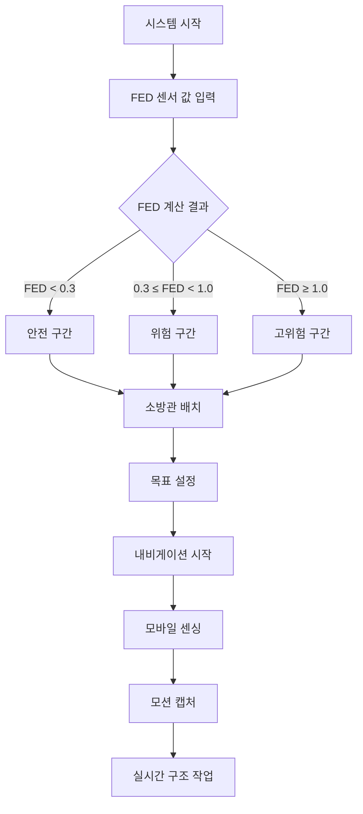

# 화재 안전 시스템 시연 시나리오

## 1. FED (Fractional Effective Dose) 계산

### 개요
- FED 계산 패널에 각 센서의 값을 입력하면 자동으로 FED가 계산됨
- FED: 질식성 가스 위험도 지표

### 위험도 구간별 기준

| FED 값 | 위험 등급 | 설명 |
|--------|----------|------|
| 0 < FED < 0.3 | **안전 구간** | 사람이 정상적인 대피 능력 유지 |
| 0.3 < FED < 0.5 | **주의 구간** | 일부 개인에서 경미한 생리적 영향이 나타날 수 있음 |
| 0.5 < FED < 1.0 | **위험 구간** | 일산화탄소(CO)와 시아나이드화수소(HCN) 같은 독성 가스로 인해 혈액의 산소 운반 능력이 저해되어 현기증, 방향감각 상실, 또는 혼수상태를 유발할 수 있음. 대피 능력이 현저히 저하됨 |
| 1.0 < FED | **고위험 구간** | 자력 대피가 불가능 |

---

## 2. 내비게이션 시연

### 단계별 진행

1. **소방관 생성**
   - Agent Manage 패널(중간 패널)에서 소방관 이름 필드 입력
   - `Spawn` 버튼 클릭

2. **경로 탐색 시작**
   - 왼쪽 드롭박스에서 소방관 선택
   - 오른쪽 드롭박스에서 목표(피구조자) 선택
   - `Start Nav` 버튼 클릭

3. **모바일 센싱**
   - 스마트폰에서 `localhost:4000` 접속
   - 센싱 시작

---

## 3. 피구조자 모션 캡처

### 실행 과정
- 빌드한 실행파일 시작
- CCTV 객체 위치에서 모션 캡처 시작
- 실시간 피구조자 위치 및 상태 추적

---

## 시연 플로우

---

## 주요 특징

- **실시간 위험도 평가**: 센서 데이터 기반 FED 자동 계산
- **지능형 경로 안내**: 소방관-피구조자 간 최적 경로 제공
- **모바일 연동**: 스마트폰을 통한 원격 센싱
- **시각적 모니터링**: CCTV 기반 실시간 모션 캡처